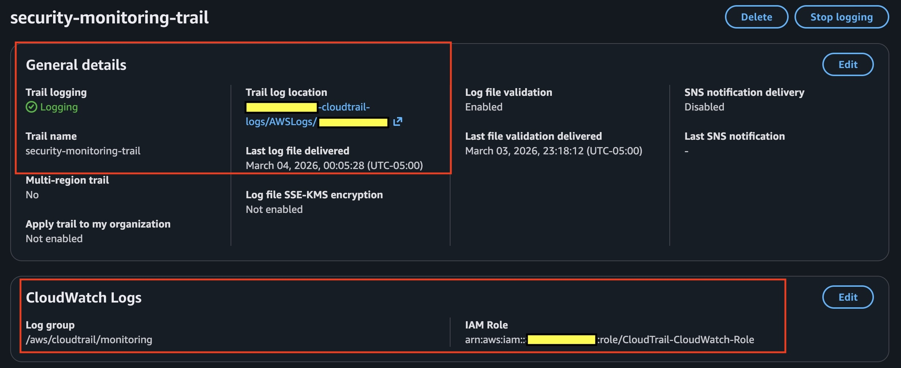
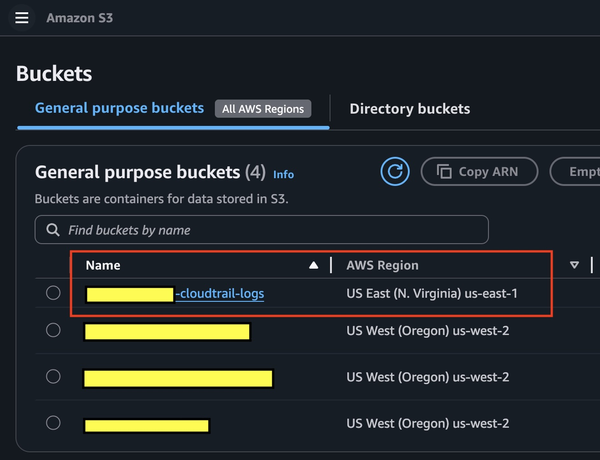
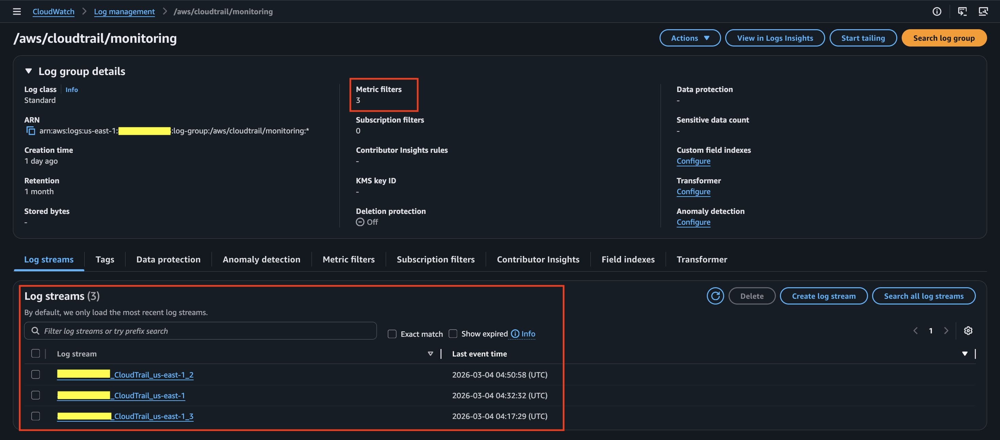
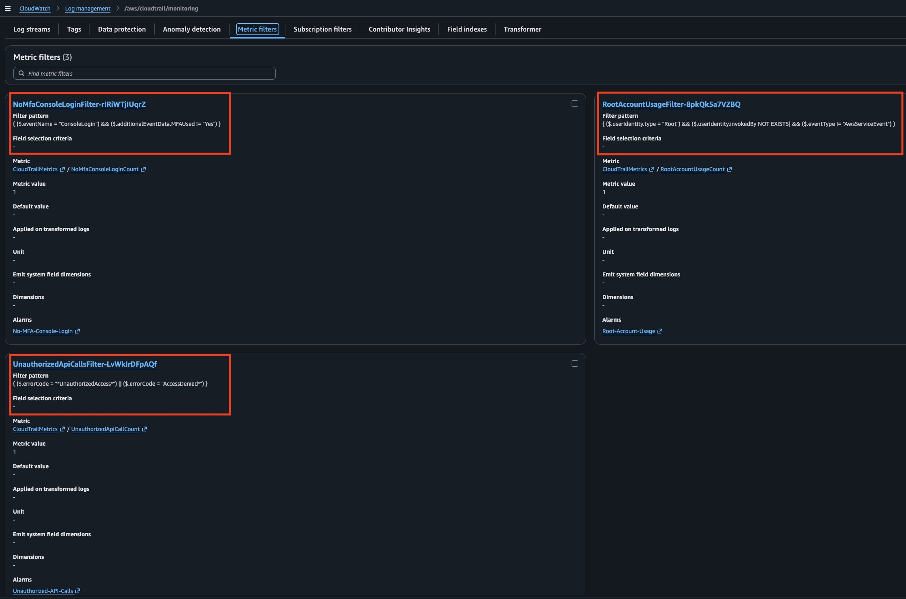
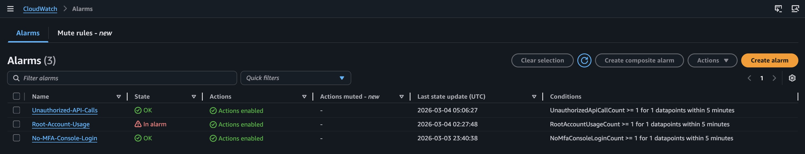
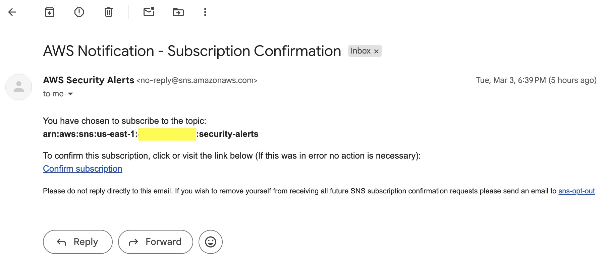
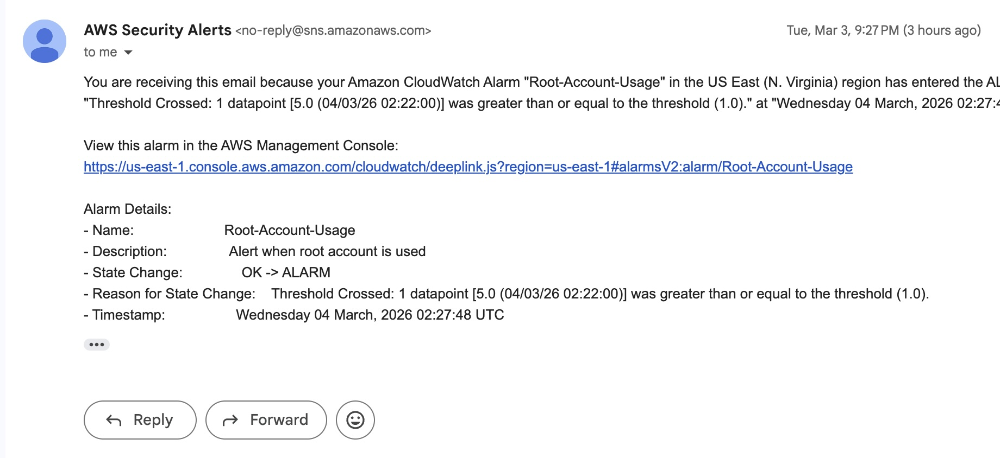
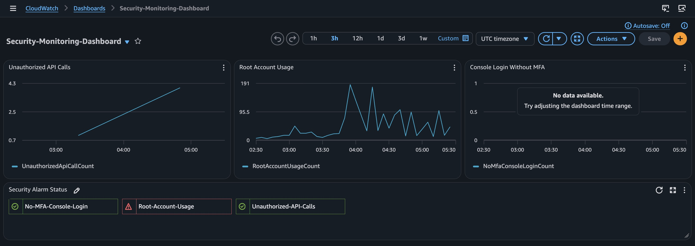

# AWS CloudTrail + CloudWatch Security Monitoring

## Description

This is a step-by-step guide to building and deploying a security monitoring and alerting pipeline on AWS using CloudFormation (Infrastructure as Code). Instead of manually clicking through the AWS Console, the entire infrastructure — logging, monitoring, alerting, and dashboards — is written in code in a CloudFormation template and deployed through the command line. The pipeline records every API call made in your AWS account, scans for suspicious activity in real time, and sends email alerts when security events are detected. The goal is to demonstrate how to build production-style security monitoring with automated detection and response like you would in a real production environment.

## Audience

This guide is intended for anyone looking to learn AWS security monitoring hands-on — whether you're pursuing a career in cloud computing, cloud security, or DevOps, or simply want to understand how real-world cloud monitoring works. The assumption is that you have basic familiarity with AWS services like S3, IAM, CloudWatch, and the AWS CLI. Step-by-step deployment instructions are provided so you can follow along even if you're still learning.

## Architecture Overview


### What Each Component Does

| Component | What It Does |
|---|---|
| **CloudTrail** | Records every API call made in the account (who did what, when, and from where) |
| **S3 Bucket** | Stores CloudTrail log files with AES-256 encryption and 90-day lifecycle policy |
| **CloudWatch Log Group** | Receives real-time log streams from CloudTrail for analysis |
| **Metric Filters** | Scans logs for specific patterns like unauthorized access or root account usage |
| **CloudWatch Alarms** | Triggers when metric filters detect suspicious activity |
| **SNS Topic** | Sends email notifications when alarms fire |
| **CloudWatch Dashboard** | Visual overview of all security metrics and alarm states in one place |

### Security Events Monitored

| Security Event | Why It Matters |
|---|---|
| **Unauthorized API Calls** | Detects `AccessDenied` and `UnauthorizedAccess` errors — could indicate compromised credentials or misconfigured permissions |
| **Root Account Usage** | Root should almost never be used in production — any usage is a red flag |
| **Console Login Without MFA** | Logging in without multi-factor authentication is a security risk |

### Customizing the Metric Filters

The metric filters in this template are fully customizable. The three filters included (unauthorized API calls, root account usage, and console login without MFA) cover common security baselines, but you can easily swap them out or add your own depending on what you want to monitor. Some examples of other filters you could add:

- **IAM Policy Changes** — detect when someone creates, deletes, or modifies IAM policies
- **Security Group Changes** — detect when firewall rules are added or removed
- **Failed Console Logins** — detect potential brute force attempts
- **Network Changes** — detect VPC, subnet, or gateway modifications
- **S3 Bucket Policy Changes** — detect when someone opens up a bucket's permissions

To add a new filter, just follow the same pattern used in the template: create a `AWS::Logs::MetricFilter` resource with your own `FilterPattern`, add a matching `AWS::CloudWatch::Alarm`, and point the alarm at the SNS topic. The CloudTrail logs capture every API call made in your account, so any event that shows up in CloudTrail can be turned into a filter.

## Prerequisites

⚠️ The installation commands in this guide are designed for **macOS**. If you're using Windows or Linux, you'll need to modify the installation steps to match your operating system.

### Homebrew (Mac only — required for the installs below)

```bash
# Check if Homebrew is already installed
brew --version

# If you get "command not found", install it:
/bin/bash -c "$(curl -fsSL https://raw.githubusercontent.com/Homebrew/install/HEAD/install.sh)"
```

NOTE: You can get the latest version from https://brew.sh

```bash
# Verify
brew --version
```

### AWS CLI

```bash
# Install the AWS Command Line Interface
brew install awscli

# Verify
aws --version
```

### Git

```bash
# Install Git for version control
brew install git

# Verify
git --version
```

### GitHub Account

- A GitHub account to host the repository
- Sign up at https://github.com if you don't have one

### Budget Awareness

⚠️ Most resources in this guide fall under the **AWS Free Tier**. CloudTrail provides one free trail per account. S3 storage costs are minimal for log files. CloudWatch free tier covers basic metrics and alarms. SNS provides the first 1,000 email notifications free. **Always run the cleanup commands when you're done to avoid unexpected costs.**

## Setup

### 1. Create an AWS Account

- Sign up at https://aws.amazon.com if you don't have one
- This will be your root account (the main admin account)

### 2. Create an IAM User

Don't use your root account for daily work — create a separate user:

1. Log into the AWS Console with your root account
2. Search for and click **IAM**
3. Click **Users** → **Create user**
4. Enter a username (e.g., your-name) and click **Next**
5. Select **Attach policies directly**
6. Search for **AdministratorAccess**, check the box, and click **Next**
7. Click **Create user**

### 3. Create an Access Key

This is what lets your terminal talk to AWS:

1. In IAM, click **Users** → select the user you just created or want to use
2. Click the **Security credentials** tab
3. Scroll to **Access keys** → click **Create access key**
4. Select **Command Line Interface (CLI)** and click **Next**
5. (Optional) Add a Set Description Tag (e.g., For Security Monitoring)
6. Click **Create access key**

⚠️ **Important:** This is the only time you will be able to see or download your Secret Access Key. If you lose it, you cannot recover it — you will need to delete the old key and create a new one. Save both keys somewhere safe before closing this page.

⚠️ **Important:** Never share your access keys with anyone or push them to GitHub.

7. Save both keys
   - Copy the **Access Key ID**
   - Copy the **Secret Access Key**

### 4. Configure AWS CLI

Open your terminal and run:

```bash
aws configure
```

You will be asked for:

- **AWS Access Key ID** — paste the Access Key ID from Step 3
- **AWS Secret Access Key** — paste the Secret Access Key from Step 3
- **Default region** — `us-east-1`
- **Default output format** — `json`

### 5. Verify AWS Access

```bash
aws sts get-caller-identity
```

You should see output similar to:

```json
{
    "UserId": "AIDAXXXXXXXXXXXX",
    "Account": "123456789012",
    "Arn": "arn:aws:iam::123456789012:user/your-username"
}
```

- `Account` — Should match the account number shown in the top right of your AWS Console
- `Arn` — Should match User → Summary → ARN

If you get an access denied error, go back to Step 2 and verify your user has **AdministratorAccess** permissions.

### Helpful Terminal Commands

| Command | What It Does |
|---|---|
| `cd folder-name` | Move into a folder |
| `cd ..` | Go back one folder |
| `pwd` | Show what folder you're currently in |
| `ls` | List files in the current folder |
| `q` | Exit a viewer (when output fills the screen) |
| `arrow up` | Repeat your last command |

## How to Deploy

### Step 1: Clone the Repository

```bash
# Navigate to the directory where you want this to be saved
cd your/preferred/folder

# Download the repo to your computer
git clone https://github.com/Alexdariio/aws-cloudtrail-monitoring.git

# Move into the folder
cd aws-cloudtrail-monitoring
```

### Step 2: Deploy the CloudFormation Stack

> **Note:** The three security filters included in this template are just a starting point. See the [Customizing the Metric Filters](#customizing-the-metric-filters) section if you want to add, remove, or modify filters before deploying.

```bash
# Creates the entire monitoring pipeline: S3 bucket, CloudTrail, CloudWatch Logs,
# metric filters, alarms, SNS topic, and dashboard — all in one template
aws cloudformation deploy \
  --template-file template.yaml \
  --stack-name monitoring-stack \
  --parameter-overrides AlertEmail=YOUR_EMAIL@gmail.com \
  --capabilities CAPABILITY_NAMED_IAM
```

⚠️ Replace `YOUR_EMAIL@gmail.com` with your actual email address. You will receive a confirmation email from SNS that you must confirm.

Check for completion:

```bash
aws cloudformation describe-stacks --stack-name monitoring-stack --query 'Stacks[0].StackStatus'
```
Run this command every 30–60 seconds until the output changes from `"CREATE_IN_PROGRESS"` to `"CREATE_COMPLETE"`. This may take a few minutes.

> **To verify on the AWS console:** Go to **CloudWatch** → **Logs** → **Log management** → Click on `/aws/cloudtrail/monitoring` log group → **Metric filters** tab — you should see 3 metric filters listed.

### Step 3: Confirm the SNS Email Subscription

1. Check your inbox for an email from **AWS Notifications**
2. Click **Confirm subscription**

⚠️ **Important:** Without confirming, you will NOT receive alert emails. Check your spam folder if you don't see it.

> **To verify in the console:**
> - Go to **CloudWatch** → **Alarms** (left sidebar) — you should see 3 alarms. They may show **INSUFFICIENT_DATA** (orange) instead of OK — this is normal and just means no matching events have come in yet.
> - If you see a warning state, don't worry — it's because you haven't confirmed the SNS email subscription yet. Once you confirm, the alarms will function normally.
> - Search for **Amazon SNS** in the search bar → **Topics** → `security-alerts` topic should show 1 confirmed subscription after you click the confirm link in your email.

⚠️ **SideNote:**
> **Why is Alarms in "in alarm" state?** If you're logged into the AWS Console using your root account (the account you created when you first signed up for AWS), every action you take generates API calls that CloudTrail detects as root account usage — which is exactly what this filter is designed to catch. This means your pipeline is working correctly. To resolve it, create an IAM user with AdministratorAccess (see the [Setup](#2-create-an-iam-user) section) and use that instead of root. The alarm will return to OK after 5 minutes once root activity stops.


### Step 4: Wait for CloudTrail to Start Logging

CloudTrail logs take **5–15 minutes** to begin appearing in CloudWatch. Browse around the AWS Console (visit S3, EC2, IAM, etc.) to generate some API calls while you wait.

### Step 5: Verify Everything Is Working

**CloudTrail:**
```bash
# Check that the trail is logging
aws cloudtrail get-trail-status --name security-monitoring-trail --query 'IsLogging'
```

Expected output: `true`

**CloudWatch Logs:**
```bash
# Check that log streams exist (may take 5-15 minutes after deployment)
aws logs describe-log-streams \
  --log-group-name /aws/cloudtrail/monitoring \
  --order-by LastEventTime --descending --limit 3 \
  --query 'logStreams[*].logStreamName'
```

You should see one or more log stream names listed.

**CloudWatch Alarms:**
```bash
# Check alarm states
aws cloudwatch describe-alarms \
  --query 'MetricAlarms[*].[AlarmName,StateValue]' --output table
```

All three alarms should show `OK` state.

**SNS Subscription:**
```bash
# Verify your email subscription is confirmed
aws sns list-subscriptions-by-topic \
  --topic-arn $(aws cloudformation describe-stacks --stack-name monitoring-stack \
    --query 'Stacks[0].Outputs[?OutputKey==`SNSTopicArn`].OutputValue' --output text) \
  --query 'Subscriptions[*].[Endpoint,SubscriptionArn]' --output table
```

Your email should show with a confirmed ARN (not `PendingConfirmation`).

**Dashboard:**

Go to **CloudWatch** → **Dashboards** → **Security-Monitoring-Dashboard** in the AWS Console. You should see three metric graphs and an alarm status widget.

> **Note:** The dashboard is configured to display the three default security filters included in this template. If you added, removed, or renamed any metric filters or alarms, update the `"metrics"` and `"alarms"` sections in the CloudWatch Dashboard JSON to match your setup.
### Step 6: Test the Alarms

To trigger an unauthorized API call alert:

```bash
# This will generate an AccessDenied event in CloudTrail
aws s3 ls s3://some-bucket-that-doesnt-exist-12345
```

After running this:

1. **Wait 5–15 minutes** for CloudTrail to process the event
2. **CloudWatch → Alarms** → `Unauthorized-API-Calls` should go to **ALARM** state (red)
3. **Check your email** → You should receive a notification from AWS Notifications

If the alarm does not fire, check CloudWatch Logs to make sure log entries are appearing, then verify the metric filter pattern is correct.

### Step 7: Verify All Resources

```bash
# Quick check of all stack outputs
aws cloudformation describe-stacks --stack-name monitoring-stack \
  --query 'Stacks[0].Outputs[*].[OutputKey,OutputValue]' --output table
```

You should see outputs for the S3 bucket name, CloudTrail ARN, Log Group name, and SNS topic ARN.

If everything shows up — 🎉 **Congratulations!** You have successfully deployed a fully automated security monitoring pipeline on AWS! Your infrastructure includes CloudTrail recording all API activity, encrypted S3 log storage with lifecycle policies, CloudWatch real-time log analysis with metric filters, automated alarms for three critical security events, SNS email notifications, and a visual dashboard — all deployed through CloudFormation with zero manual console clicks.

**Remember:** Don't forget to run the Clean Up steps when you're done to avoid unexpected AWS charges.

## Screenshots

### CloudTrail Trail — Logging Active
> 

### S3 Bucket — Encrypted Log Storage with Lifecycle Rules
> 

### CloudWatch Log Management -> Log Group — Real-Time Log Streams
> 

### Metric Filters — Security Event Detection
> 

### CloudWatch Alarms — Alarm Triggered
> 

### Email Confirmation — SNS Alert
> 

### Email Notification — SNS Alert
> 

### CloudWatch Dashboard — Security Overview
> 

## Clean Up

In order to clean up the resources in your AWS account and avoid incurring any additional charges, you need to empty the S3 bucket first and then delete the stack. CloudFormation handles deleting all the individual resources within the stack automatically.

⚠️ **Important:** You must empty the S3 bucket before deleting the stack, otherwise CloudFormation will fail because it cannot delete a bucket that contains files.

### Step 1: Empty the S3 Bucket

```bash
# Delete all CloudTrail log files from the bucket
aws s3 rm s3://$(aws sts get-caller-identity --query Account --output text)-cloudtrail-logs --recursive
```

### Step 2: Delete the Stack

```bash
aws cloudformation delete-stack --stack-name monitoring-stack
```

Check status:

```bash
aws cloudformation describe-stacks --stack-name monitoring-stack --query 'Stacks[0].StackStatus'
```

Run this command every 30–60 seconds until it returns an error saying the stack does not exist, which confirms it was deleted.

### Step 3: Verify Everything Is Gone

```bash
aws cloudformation list-stacks \
  --stack-status-filter CREATE_COMPLETE UPDATE_COMPLETE \
  --query 'StackSummaries[*].StackName' --output table
```

The `monitoring-stack` should not appear in this list. If the table is empty, everything has been successfully cleaned up.

Also verify manually in the console:

- **S3** — Bucket should be gone
- **CloudTrail** — Trail should be gone
- **CloudWatch Logs** — Log group should be gone
- **CloudWatch Alarms** — All three alarms should be gone
- **SNS** — Topic should be gone

